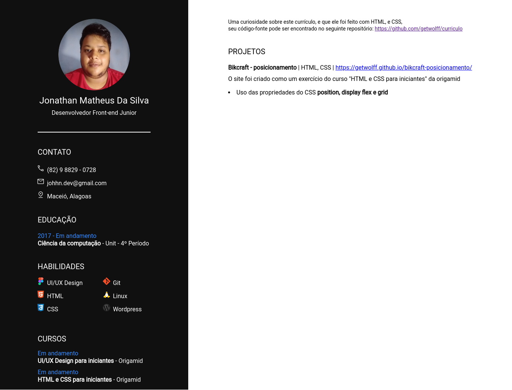

# Curriculo
Meu currículo feito com HTML e CSS.

## Link
- Site-curriculo: https://jonathan-matheus.github.io/curriculo/

## Tecnologias
HTML | CSS | Figma | Git

## Novos conhecimentos
Estudei algumas propriedades do CSS para tratar melhor a foto de perfil, sem perder qualidade de imagem, mas, depois alterei a imagem para uma foto editada, usando figma mesmo, vi que erra a melhor alternativa.

## Imagens
### home

## Desafios
Durante o processo de desenvolvimento da segunda versão do site (no caso v1, já que a primeiro se chamava v0) tive que trocar de monitor, mudei para um monitor menor, o que acabou me trazendo alguns problemas em relação as dimensões dos arquivos de design feitos no figma, não estava conseguindo alinhar os elementos de forma correta seguindo o arquivo de design, mas depois de algumas alterações nas dimensões do arquivo de referência de design que estava usando consegui alinhar tudo de forma correta.

Você pode encontrar esse arquivo no próprio repositório do projeto, na pasta design, e um arquivo .fig (curriculo.fig)

Observação: fiz algumas alterações no layout do site posterior mente, que não estavam previstas no design inicial fiz estas alterações pois pensei que o site ficou mas bonito e organizado com elas.